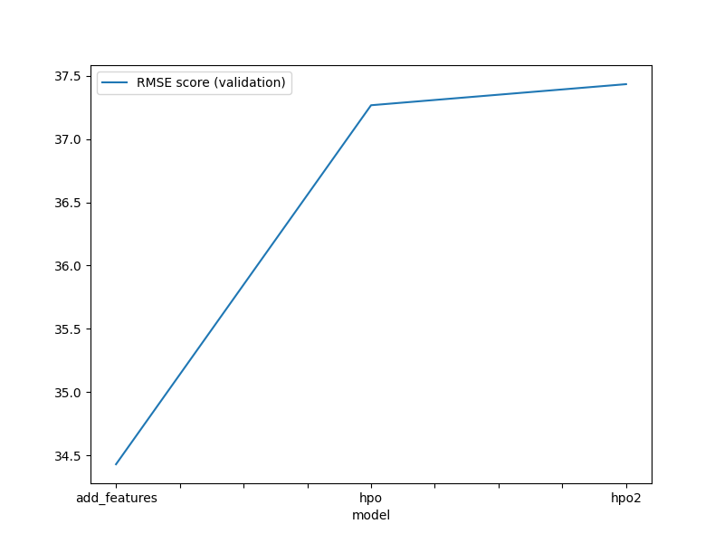
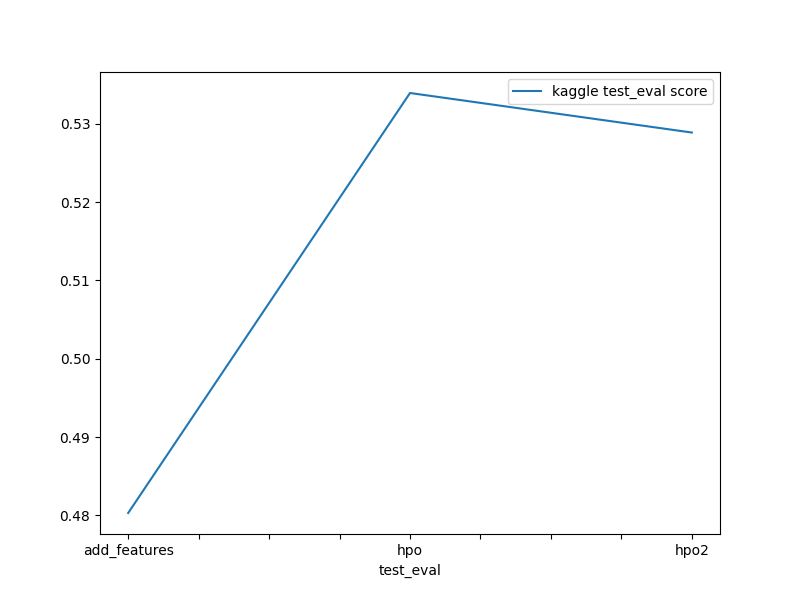

# Report: Predict Bike Sharing Demand with AutoGluon Solution
#### Ashish Rohilla

## Initial Training
### What did you realize when you tried to submit your predictions? What changes were needed to the output of the predictor to submit your results?
i had done 3 experiments 
1 by Adding Feature engineering and performing EDA 
2 hpo1 that is by using hyper paramets 
hpo2  by adding some other hyperparameters 

observation : 
by pushing the result i found that kaggle refuses the submissions containing negative predictions values 

so by removing the neagtive values changes are incorparated 

### What was the top ranked model that performed?
The top-ranked model was the (add features) model named WeightedEnsemble_L2, with a validation RMSE score of 37.1416 and the best Kaggle score of 0.48032  (on test dataset). This model was developed by training on data obtained using exploratory data analysis (EDA) and feature engineering without the use of a hyperparameter optimization routine. Upon hyperparameter-optimization, some models did show improved RMSE scores on validation data; however this model delivered the best performance on unseen test dataset. Note that many models delivered competitive performance, hence the selection was done considering both RMSE (cross-validation) and Kaggle (test data) scores respectively.

## Exploratory data analysis and feature creation
Feature datetime was parsed as a datetime feature to obtain hour information from timestamp
Independent features season and weather were initially read as integer. Since these are categorical variables, they were transformed into category data type.
The data for year, month, day (dayofweek) and hour were extracted as distinct independent features from the datetime feature using feature extraction. Upon feature extraction, datetime feature was dropped.
### What did the exploratory analysis find and how did you add additional features?
by using data visualisation we found the relation btw the other fetures and changing date time into date time field season , weather , catogry helped the model to perform well

### How much better did your model preform after adding additional features and why do you think that is?
by adding additional feature the model performed well and increased performance to grateer extent.
also spliting date time feature into multiple feature also improved the model
## Hyper parameter tuning
### How much better did your model preform after trying different hyper parameters?
while performing hyperparameter optimization using autogluon, the 'time_limit' and 'presets' parameters are quite crucial.
hyperparameter optimization with presets like "high_quality" (with auto_stack enabled) require high memory usage and are computationally intensive for the prescribed time limit using available resources. Hence, lighter and faster preset options like 'medium_quality' and 'optimized_for_deployment' were experimented with. I preferred faster and lighter preset,

### If you were given more time with this dataset, where do you think you would spend more time?
i would like to spend more time on data exploration finding some other corelation features.
also by playing with  presets and hyper paramerts 

### Create a table with the models you ran, the hyperparameters modified, and the kaggle score.
| sr.no | model        | hpo                                    | hpo2                                      | score   |
|-------|--------------|----------------------------------------|-------------------------------------------|---------|
| 0     | add_features | prescribed_values                      | presets: 'high quality' (auto_stack=True) | 0.48030 |
| 1     | hpo          | prescribed_values                      | presets: 'high quality' (auto_stack=True) | 0.53395 |
| 2     | hpo2         | Tree-Based Models: (GBM, XT, XGB & RF) | presets: 'optimize_for_deployment         | 0.52890 |

### Create a line plot showing the top model score for the three (or more) training runs during the project.

TODO: Replace the image below with your own.

### Create a line plot showing the top kaggle score for the three (or more) prediction submissions during the project.

TODO: Replace the image below with your own.

## Summary
mmary
The AutoGluon AutoML framework for Tabular Data was thoroughly studied and incorporated into this bike sharing demand prediction project.
The AutoGluon framework's capabilities were fully utilized to make automated stack ensembled as well as individually distinct configured regression models trained on tabular data. It assisted in quickly prototyping a base-line model.
The top-ranked AutoGluon-based model improved results significantly by utilizing data obtained after extensive exploratory data analysis (EDA) and feature engineering without hyperparameter optimization.
Leveraging automatic hyperparameter tuning, model selection/ensembling and architecture search allowed AutGluon to explore and exploit the best possible options.
Addtionally, hyperparameter tuning using AutoGluon also offered improved performance over the initial raw submission; but it wasn't better than that of the model with EDA, feature engineering and no hyperparameter tuning.
It was noticed that hyperparameter-tuning using AutoGluon (without default hyperparameters or random configuration of parameters) is a cumbersome process, and is highly dependent on the time limit, prescribed presets, possible family of models and range of hyperparameters to be tuned.
